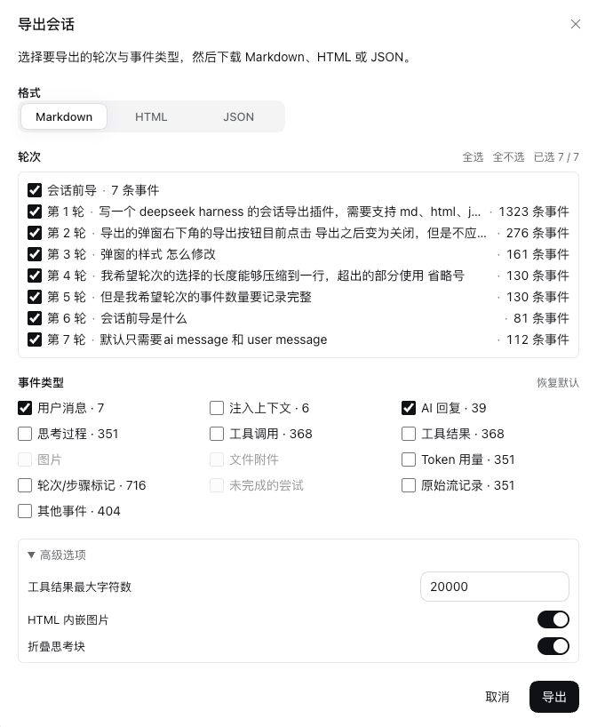

# dsh-session-export

把 DeepSeek Harness 的会话导出为 **Markdown / HTML / JSON**，并且可以自由选择导出哪些**轮次**、哪些**事件类型**。

数据直接来自本地磁盘上的会话日志（`readSession` 的事件数组），不需要额外服务或网络请求。



## 功能

| 能力 | 说明 |
|---|---|
| 三种格式 | `Markdown`（原始 Markdown 转录）、`HTML`（自包含单文件，可离线打开）、`JSON`（原始事件数组） |
| 轮次选择 | 逐轮勾选，支持「全选 / 全不选」，按轮号或提示词过滤；第一条 `turn/start` 之前的事件作为「会话前导」单独一项 |
| 事件类型选择 | 13 类开关自由组合，见下方事件类型表 |
| 实时计数 | 每个轮次显示事件条数，每个事件类型显示当前选中轮次内的条数；无内容的类型自动置灰 |
| 高级选项 | 工具结果最大字符数、HTML 内嵌图片、折叠思考块 |
| 可复用面板 | 导出完成后弹窗不关闭，可以直接换格式或换选择继续导出，支持一次会话导出多份 |
| 安全 | HTML 导出先转义再渲染，会话文本里的 `<script>`、`</style>`、`javascript:` 链接、`onerror=` 等无法逃逸 |
| 轻依赖 | 插件不声明任何运行时依赖，安装只是一个符号链接 + 一行配置 |

**默认只导出「用户消息」和「AI 回复」**，开箱即得一份干净的对话记录。思考过程、工具调用/结果、图片、文件附件、注入上下文、Token 用量、轮次/步骤标记、未完成的尝试、原始流记录、其他事件默认都不勾选，需要时在弹窗里逐个勾上即可。

### 事件类型

| 事件类型 | 默认 | 导出内容 |
|---|:--:|---|
| 用户消息 | ✅ | 你输入的提示词（`user/message`，`source.kind === 'user'`） |
| AI 回复 | ✅ | 模型输出的正文 |
| 思考过程 | ☐ | 模型的 reasoning 内容（`thinking`），HTML 里默认折叠 |
| 工具调用 | ☐ | 工具名 + 参数（原始 JSON，导出时美化缩进） |
| 工具结果 | ☐ | 工具返回值，可按「工具结果最大字符数」截断，截断处会写明省略了多少字符 |
| 图片 | ☐ | 消息里的图片附件（HTML 可内嵌为 data URI，Markdown 输出占位说明） |
| 文件附件 | ☐ | 消息里的文件引用（名称与体积，不含文件内容） |
| 注入上下文 | ☐ | 系统提示、开发者消息，以及工具结果、子目录 AGENTS.md、技能内容等自动注入的上下文 |
| Token 用量 | ☐ | 每次模型调用的输入/输出/缓存 token |
| 轮次/步骤标记 | ☐ | `turn/start`、`turn/end`、`step/start`、`step/end` 时间线标记 |
| 未完成的尝试 | ☐ | 失败、被重试或中断的模型调用（`assistant/attempt`） |
| 原始流记录 | ☐ | 模型输出的原始流式记录（最详细，体积最大） |
| 其他事件 | ☐ | 以上未覆盖的会话级事件：权限预设、沙箱模式、审批策略、计划模式、会话前导里的注入记录等 |

## 环境要求

- DeepSeek Harness，Web profile（`dsh web` / `dsh --profile web`）
- 安装脚本需要 Node.js ≥ 22（插件本身不在 Harness 里运行额外进程）

## 安装

```sh
git clone git@github.com:navms/dsh-session-export.git
cd dsh-session-export
node scripts/install.mjs
```

安装脚本会做两件事（幂等，可重复执行）：

1. 在 `$DSH_HOME/profiles/web/node_modules/` 下建立指向本目录的符号链接；
2. 在 `$DSH_HOME/profiles/web/cordis.patch.yml` 追加本插件的加载项（首次修改前会备份为 `*.dsh-session-export.bak`）。

常用参数：

```sh
node scripts/install.mjs --dry-run            # 只打印将要做的动作，不写任何文件
node scripts/install.mjs --profile web        # 指定 profile（默认 web）
node scripts/install.mjs --home /path/to/.dsh # 指定 Harness home（默认 $DSH_HOME 或 ~/.dsh）
node scripts/install.mjs --uninstall          # 卸载：移除链接与配置项，原文件逐字节复原
```

安装或更新后需要**重启 `dsh web` 并刷新浏览器页面**。

### 手动安装

不想用脚本的话：

```sh
ln -s "$PWD" ~/.dsh/profiles/web/node_modules/dsh-session-export
cat >> ~/.dsh/profiles/web/cordis.patch.yml <<'YAML'

- insert:
    - id: session-transcript-export
      name: 'dsh-session-export'
YAML
```

## 使用

1. 打开任意会话，点击会话头部的 **导出按钮**（下载图标）；
2. 选择 **格式**：Markdown / HTML / JSON；
3. 勾选要导出的 **轮次**（可全选/全不选，轮次多时可用过滤框按轮号或提示词搜索）；
4. 勾选要包含的 **事件类型**（可按需展开「高级选项」调整截断阈值等）；
5. 点击 **导出**，浏览器开始下载；弹窗保持打开，可以换一组选择继续导出。

导出的文件名由服务端生成：`dsh-session-<会话ID>-<YYYYMMDD-HHmm>.<扩展名>`（时间为 UTC）。

### 选择规则

- **未勾选的轮次**：完全不出现在导出结果中。
- **勾选了但被事件类型过滤为空**的轮次：Markdown / HTML 会跳过（文首摘要里写明跳过了几轮），JSON 会保留该轮并给出 `events: []`。
- **会话前导**：第一条 `turn/start` 之前的事件集合（权限预设、沙箱模式、审批策略这类会话级记录）。它的事件都属于「其他事件」，只勾「会话前导」而「其他事件」保持关闭时，这一段不会输出任何内容。会话如果没有前导事件，弹窗里不会出现这一行。
- **内容为空的消息**：例如只带图片、没有文字的消息，在「图片」关闭时不会输出。
- **轮次过多**：单次导出的轮次数量受 `maxTurns` 限制（默认 2000），超出时弹窗会提示先缩小选择范围。

### 导出格式说明

**Markdown**：文首是会话信息（ID、创建时间、工作目录、模型、选中轮次、导出时间），随后每轮一个 `## 轮次 N` 小节，事件按发生顺序排列；思考块用可折叠的 `<details>`；工具参数与结果用围栏代码块，并按内容自动加长围栏避免冲突。

**HTML**：单文件、内联样式、无外部资源，可直接发给别人或离线打开；跟随系统亮/暗主题；顶部有轮次目录；开启「HTML 内嵌图片」时图片以 data URI 内嵌（有总字节预算，超出部分回退为占位说明）。

**JSON**：原始事件数组按选择过滤后输出，便于二次处理。事件对象保持会话日志原样（`type` / `seq` / `time` / `data`）。

```json
{
  "format": "dsh-session-transcript",
  "version": 1,
  "exportedAt": "2026-09-29T04:13:20.000Z",
  "generator": { "name": "dsh-session-export", "version": "0.1.0" },
  "selection": {
    "format": "json",
    "turns": [1, 2],
    "includePreamble": true,
    "sections": { "user": true, "assistant": true, "thinking": false, "…": false },
    "options": { "maxToolResultChars": 20000 }
  },
  "session": {
    "id": "session-…",
    "createdAt": 0,
    "cwd": "…",
    "model": { "provider": "…", "model": "…" },
    "title": "…"
  },
  "preamble": { "eventCount": 3, "events": [{ "type": "permission/preset", "seq": 0, "time": 0, "data": { "preset": "workspace-write" } }] },
  "turns": [
    {
      "turn": 1,
      "startSeq": 3,
      "endSeq": 11,
      "startedAt": 0,
      "endedAt": 0,
      "endReason": "completed",
      "open": false,
      "eventCount": 9,
      "events": [{ "type": "user/message", "seq": 4, "time": 0, "data": { "…": "…" } }]
    }
  ]
}
```

过滤规则：关闭「原始流记录」会删除 `data.stream`，关闭「Token 用量」会删除 `data.usage`，关闭「思考过程」「AI 回复」「工具调用」「图片」「文件附件」会从 `data.message.content` 中移除对应类型的块。

## 配置

可以在 profile 的 `cordis.patch.yml` 里按需覆盖默认值：

```yaml
- id: session-transcript-export
  name: 'dsh-session-export'
  config:
    maxTurns: 2000                  # 单次导出的轮次上限
    maxToolResultChars: 20000       # 工具结果 / 其他事件的截断阈值
    maxOutputBytes: 33554432        # 导出文件字节上限
    maxEmbeddedImageBytes: 8388608  # HTML 内嵌图片总预算
    defaultSections:                # 只写想改的键，其余保持默认
      thinking: true
      toolCalls: true
```

## 常见问题

| 问题 | 原因 / 处理 |
|---|---|
| 勾了「会话前导」却什么也没有 | 前导事件全部属于「其他事件」，需要同时勾选「其他事件」 |
| 图片没有导出 | 「图片」默认关闭；另外只含图片的消息在关闭该开关时不会输出任何内容 |
| 某个轮次消失了 | 该轮勾选后被事件类型过滤为空，Markdown / HTML 会跳过（JSON 会保留 `events: []`） |
| 弹窗内出现红色错误提示 | 会话日志读取失败或会话已被清理；按提示调整后点「重试」，或关闭弹窗重开 |
| 只想导出最近几轮 | 点「全不选」后按轮号勾选，或在上方过滤框里按轮号/关键词筛选 |
| 导出后再导一次 | 弹窗不会关闭，换格式或换选择继续点「导出」即可 |

## 已知限制

- 一次只导出**当前会话**；子会话（subagent）不会递归导出，附件也不打包（Harness 自带的 `/export` 命令会导出 ZIP 归档）。
- 入口只有会话头部的导出按钮，不注册斜杠命令。
- HTML 里的 Markdown 渲染为内置子集（标题、围栏代码、引用、列表、分隔线、段落、行内代码/粗体/斜体/删除线/链接）；表格、脚注、数学公式、原始 HTML 会按转义文本输出。
- 导出会把会话日志读入内存，因此超大会话受「工具结果最大字符数」与产物字节上限约束。
- 轮次数量超过 `maxTurns` 时需要先缩小选择范围。
